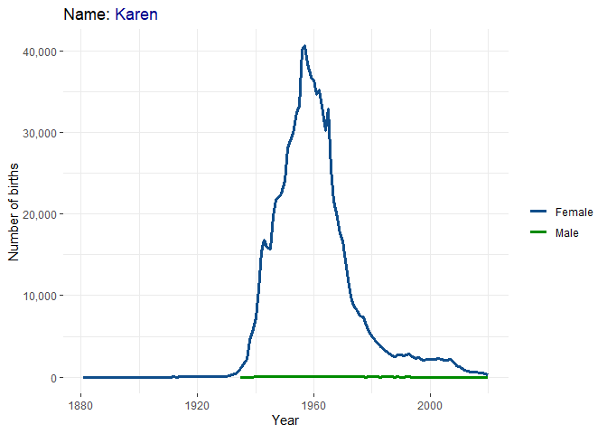

Homework 04
================
Thao Tran

``` r
library(tidyverse)
library(ggtext)
```

    ## Warning: package 'ggtext' was built under R version 4.1.3

``` r
library(rsconnect)
```

    ## Warning: package 'rsconnect' was built under R version 4.1.3

1.  **How popular am I?**

``` r
# load data
bbnames = read.csv("data/babynames.csv")

#rename labels
bbnames$sex = ifelse(bbnames$sex=="F","Female","Male")

#my name is not common and has a lot of missing data so I went with a different name 
#line plot for names
bbnames %>% filter(name=="Karen") %>% 
  ggplot(aes(y = n, x = year,color = sex, group= sex)) +
  geom_line(lwd=1.25)+
  labs(
    title = "Name: <span style='color:blue4'>Karen</span>",
    y = "Number of births",
    x = "Year",
    color = ""
  )+
  theme_bw()+
  theme(
    panel.border = element_blank(),
    plot.title = element_markdown()
  )+scale_y_continuous(labels = scales::comma)+
  scale_color_manual(values = c("dodgerblue4","green4"))
```

<!-- -->

2.  **The app**

Link: <https://thaophuongtran.shinyapps.io/DataViz_Hw4_Prob2_TT/>

``` r
# deploy application
#rsconnect::deployApp('https://thaophuongtran.shinyapps.io/DataViz_Hw4_Prob2_TT/')
```

3.  **The styled app**

Link: <https://thaophuongtran.shinyapps.io/DataViz_Hw4_Prob3_TT/>

``` r
# deploy application
#rsconnect::deployApp('https://thaophuongtran.shinyapps.io/DataViz_Hw4_Prob3_TT/')
```
